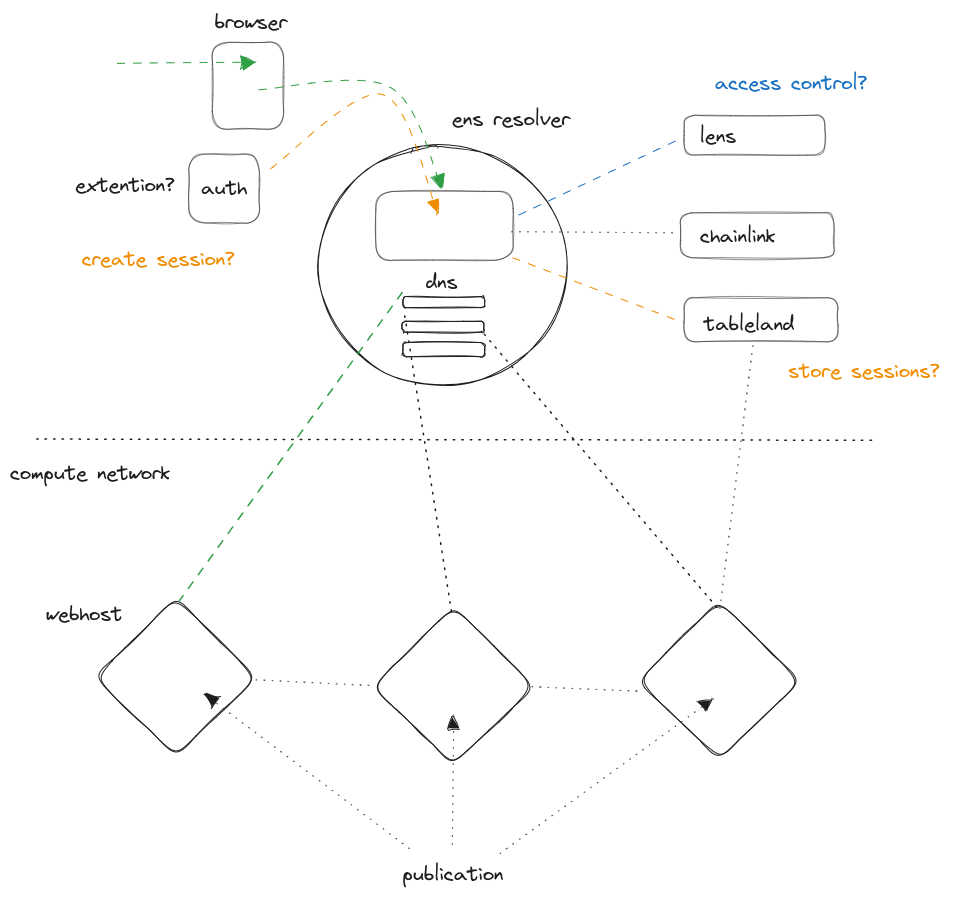
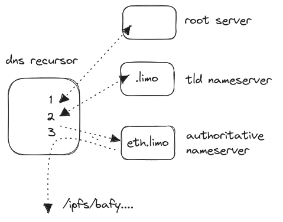
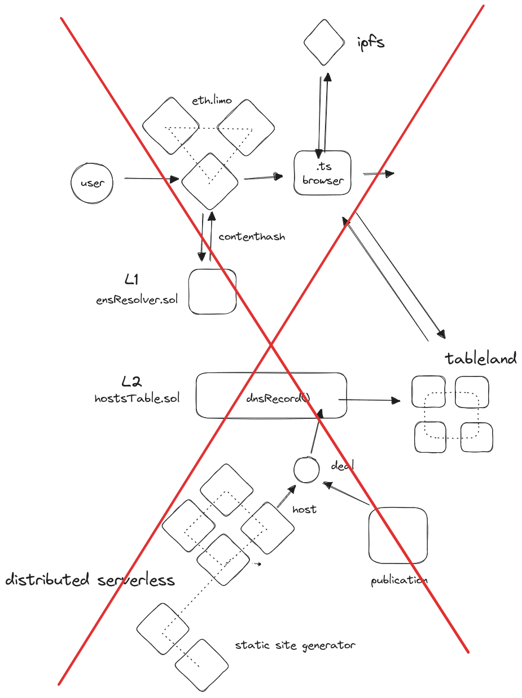
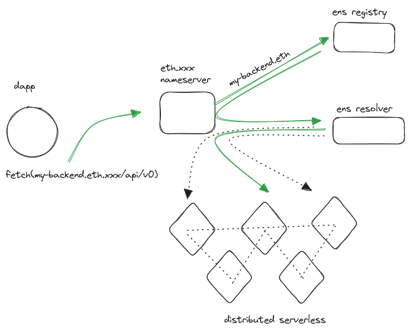

## ENS2DNS

## the plan

the aim was to explore ways to use dns records to route traffic from an ens domain.

my reason for that is that I build a proof of concept static site generator on a distributed serverless network. From that point of view it feels natural to design resilience by hosting the content trough multiple services on multiple machines. 

the idea was that building a "smart" load balancer inside a contract would open up interesting possibilities to add extra functionality.

## problems

problem 1: I didn't really understand how dns works

problem 2: current gateway solutions only facilitate contenthash to direct browser to content on ipfs/arweave

- eth.link (cloudfare)
- eth.limo (distributed & privacy preserving)
- dweb.link (brave browser)

Saturday - panicking a little -  I spend on a fools errand trying to create a workaround with javascript running in the browser loaded from ipfs by route of the contenthash retrieved through eth.limo. Obviously that didn't really work as the Internet is too secure to allow potential spoofing like that. Good for us! 

## code

in the process I did deploy a custom ens resolver contract to Sepolia, as well as a contract controlling a table in Tableland, where dns records can be written and retrieved from. Using Tableland on a L2 as a keyvalue store seems easier than replicating an L1 contract on L2  and connecting them over CCIP. I also learned about formatting dns records in wire format, which anecdotally was the first time AI could really help me with something I couldn't figure out googling. 

## what's next?

option 1: pivot to using ipfs, as does everybody else
option 2: double down and deploy and adopt a nameserver myself

## p.s.

while ipfs may be way to go for hosting content from my distributed static site generator, there is a more obvious use case for ens2dns and that is relatively simple distributed, governable endpoints. 

